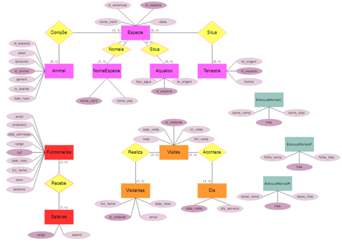

<div align="center">

# Banco de Dados - Zoológico

[](https://github.com/BeatrizJardimm/BD-Zoologico/blob/develop/LICENSE)
  
</div>

## Cenário 
<br>

<p align="justify">
    Banco de dados desenvolvido para um zoológico composto por espécies vindas de várias regiões diferentes do planeta. Os animais são de grande importância, portanto, é preciso recolher dados tanto da espécie (região de origem, nome científico, estilo de alimentação, se é venenosa  etc.), quanto de cada animal (tamanho, peso, se possui alguma doença, entre outros). A quantidade de alimento que o zoológico precisa comprar para esses animais também é uma informação importante, sendo assim, é preciso considerar essas quantidades.
    Para que consigam entrar no zoo, os visitantes devem fazer um cadastro simples, que servirá para diversas análises sobre o público.
    Além disso os funcionários também são fundamentais, por isso, todos precisam estar cadastrados no sistema com dados desde seu contato até  sua respectiva data de admissão e cargo.
</p>

## Características do projeto 
<br>

<p align="justify">
    O projeto é composto pelo arquivo BD-Zoológico.sql que apresenta a construção do banco de dados utilizando <b>MYSQL</b> e ao final, algumas análises feitas com base nos dados inseridos (a partir da linha 186). Já a pasta "midia" é composta por todas as imagens utilizadas no arquivo que você está lendo agora!
</p>

#### Relação de informações a serem extraídas:
<br>

1.  Média da idade dos visitantes;
<br>
2.	Moda da idade dos visitantes;
<br>
3.	Quantidade de visitantes em determinada hora;
<br>
4.	Dia da semana com mais visitantes;
<br>
5.	Tempo médio de visita por visitante;
<br>
6.	Média de satisfação dos visitantes;
<br>
7.	Média da idade dos funcionários;
<br>
8.	Sexo predominante entre os funcionários;
<br>
9.	Média do tempo de trabalho dos funcionários;
<br>
10.	Porcentagem das espécies que são venenosas;
<br>
11.	Porcentagem de espécies aquáticas e terrestres;
<br>
12.	Porcentagem de animais aquáticos vindos de uma certa região;
<br>
13.	Porcentagem de animais terrestres vindos de uma certa região;
<br>
14.	Quantidade de animais de uma espécie;
<br>
15.	Média da idade dos animais de uma espécie;
<br>
16.	Porcentagem de fêmeas e machos em determinada espécie;
<br>
17.	Porcentagem de animais doentes (por espécie);
<br>
18.	Quantidade de espécies carnívoras, herbívoras e onívoras;
<br>
19.	Média do peso dos animais adultos de cada espécie;
<br>
20.	Quantidade de alimento consumida por categoria (carne, folhas e ração);
<br>
21.	Encontrar o nome científico de todos os animais;
<br>
22.	Encontrar quais cargos estão disponíveis.

#### Diagrama Entidade Relacionamento (DER):

<div align="center">



</div>

#### Dependências funcionais:
<br>
id_animal → data_nasc, genero
<br>
id_especie → {nome_cient, is_venenosa, dieta, re_origem}
<br>
nome_cient → nome_pop
<br>
mes → {carne_comp, folha_comp, racao_comp}
<br>
cpf → {full_name, data_nasc, data_admissao}
<br>
cargo → salario
<br>
id_visitante → {full_name, data_nasc}
<br>
data_visita → dia_semana

#### Modelo lógico:
<br>
Animal(id_animal, id_especie, peso, tamanho, genero, data_nasc, is_doente)
<br>
Especie(id_especie, nome_cient, is_venenosa, dieta)
<br>
NomeEspecie(nome_cient, nome_pop)
<br>
Aquaticos(id_especie, tipo_agua, re_origem)
<br>
Terrestres(id_especie, bioma, re_origem)
<br>
EstoqueMensalC(mes, carne_comp, carne_disp)
<br>
EstoqueMensalF(mes, folha_comp, folha_disp)
<br>
EstoqueMensalR(mes, racao_comp, racao_disp)
<br>
Funcionarios(cpf, cargo, full_name, data_nasc, telefone, email, endereco, data_admissao, sexo)
<br>
Salarios(cargo, salario)
<br>
Visitantes(id_visitante, full_name, data_nasc, email)
<br>
Visitas(id_visitante, data_visita, ini_visita, fim_visita, nota)
<br>
Dia(data_visita, dia_semana)

##  Como criar uma cópia do projeto

Para obter uma cópia desse projeto em sua máquina local, siga os passos abaixo:

1. Crie um *Fork* desse projeto no seu perfil do GitHub
2. Instale a IDE de sua preferência* que permita manipular bancos de dados desenvolvidos em MYSQL ([Aqui](https://www.eversql.com/top-7-mysql-gui-tools-for-windows/) estão algumas opções para Windows).
3. Instale a versão do [Git](https://git-scm.com/downloads) compatível com seu sistema operacional.
4. Depois de [configurar o Git](https://www.youtube.com/watch?v=UBAX-13g8OM) em sua máquina, rode o seguinte código:

<code>
$ git clone hhttps://github.com/BeatrizJardimm/BD-Zoologico.git
</code>

Agora você tem uma cópia do projeto em sua máquina! :)

*Eu utilizei o **MySQL Workbench**, e a partir [desse artigo](https://www.devmedia.com.br/instalando-e-configurando-a-nova-versao-do-mysql/25813) você pode configurar tal IDE.

##  Como contribuir

Caso encontrou algum erro na construção do BD ou pontos que podem ser melhorados, fique a vontade para fazer modificações na versão que você instalou em sua máquina! Para isso, crie uma nova branch e dê um nome sugestivo a ela.
<br>
Faça suas alterações **APENAS** dentro dessa branch.
<br>
Após fazer suas alterações, suba a nova versão dos códigos para seu repositório no GitHub utilizando o ```git push <nome-branch>```, e então é só [criar um *pull request*](https://docs.github.com/pt/pull-requests/collaborating-with-pull-requests/proposing-changes-to-your-work-with-pull-requests/creating-a-pull-request) na plataforma do GitHub.

## Considerações finais

Prontinho!
<br>
Com base nas informações desse documento, agora você é capaz de acessar, modificar e compartilhar esse projeto!
<br>

<div align="center">


</div>

##  Autora

Meu perfil no [GitHub](https://github.com/BeatrizJardimm).
<br>
Meu perfil no [LinkedIn](https://www.linkedin.com/in/paula-beatriz-jardim-11882521a/).
